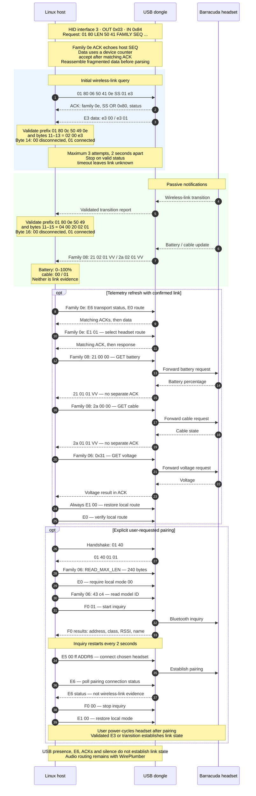

# Barracuda X HID observations

These are empirical observations, not an official Razer protocol specification.
They cover the Barracuda X (2022) dongle identified as USB `1532:0552`
(model observed: `RZ04-04430-100`, product: `Razer Barracuda X 2.4`).

## Protocol overview

The diagram summarizes link detection, passive notifications, telemetry refresh
and explicitly requested pairing. Commands use HID report ID `01`, padded to
64 bytes. See the sections below for complete validation rules and framing.



## USB and HID interfaces

The observed composite device has audio-control interface 0, audio-streaming
interfaces 1 and 2, and HID interface 3. Audio uses `snd-usb-audio`; HID uses
`usbhid`. HID interrupt endpoints are OUT `0x03` and IN `0x84`, with 64-byte
packets. The former tray monitor sent only the validated E3 connection query to the OUT
endpoint; the [DKMS driver](DKMS.md) sends only the validated commands listed in
this document.

The HID descriptor exposes report ID 1 with 63-byte vendor-defined input/output
payloads and report ID 2 for media controls. Linux includes the report ID as byte 0
of the input buffer. Device-node numbers are not stable: find the device through
`/sys/class/hidraw/*/device/uevent` and match
`HID_ID=0003:00001532:00000552`.

## Play/pause button

Physical-device testing on 2026-09-22 confirmed that a short press of the headset's
power/play button sends HID report ID 2 through the USB dongle:

| Action | Complete observed report |
| --- | --- |
| Press | `02 00 02 00 00` |
| Release | `02 00 00 00 00` |

Three short presses produced three matching press/release pairs in a read-only
hidraw capture. Bit 1 of byte 2 (indices include the report ID) corresponds to the
descriptor's consumer Play/Pause usage. Linux exposes `KEY_PLAYPAUSE` (164) in the
device's input capabilities. End-to-end playback toggling was also confirmed by
the user on the physical headset.

The desktop handles this media key and forwards playback control to its selected
media player. Neither the pairing CLI nor the driver translates or injects media keys. These
report-ID-2 frames are not wireless-link evidence and are ignored by its link
parser. Capturing them requires no output command or driver reload.

This validation covers single short presses only. Descriptor entries for other
media controls do not establish which button gestures generate them.

## Validated link report

Indices are zero-based and include the report ID:

| Buffer bytes | Observed meaning |
| --- | --- |
| 0..4 | `01 80 0E 50 49`, link-report prefix |
| 5..10 | Variable data; do not infer link state from these bytes |
| 11..15 | `04 00 20 02 01`, observed link-report marker |
| 16 | `00`: no link; `01`: link active |

Example reports (remaining bytes omitted):

```text
01 80 0E 50 49 08 F7 0D 32 69 00 04 00 20 02 01 00
01 80 0E 50 49 08 F8 4C 70 69 00 04 00 20 02 01 01
```

Later captures showed byte 10 equal to `03`, so it is not a constant.
Unknown values at byte 16 must be ignored. Validate the frame before reading it.

A different report also arrives around power transitions:

```text
01 80 0C 50 49 0E F5 00 00 00 00 02 00 E3 01 00 00
```

Its byte 16 is not the link field described above. Treating all report-ID-1 frames
as equivalent caused a connected headset to be incorrectly marked disconnected.
Later firmware and hardware analysis identified this E3 frame: its connection
value is byte 14, not byte 16. Validate bytes 0..5 (`01 80 0C 50 49 0E`) and
11..13 (`02 00 E3`), then read byte 14 as `00`/`01`.

## Battery and charging notifications

Physical testing on 2026-09-22 identified additional PI type-8 messages arriving
through the dongle with the headset connected. Their inner payloads are:

| Payload | Observed meaning |
| --- | --- |
| `21 02 01 VV` | Battery percentage; observed decimal 54 through 58 |
| `2a 02 01 01` | Charging cable connected during the test |
| `2a 02 01 00` | Charging cable removed during the test |

For a complete, single-report message, validate bytes 0..5
(`01 80 0e 50 49 08`), bytes 11..12 (`04 00`), and bytes 14..15 (`02 01`)
before reading selector byte 13 and value byte 16. The tunneled PI message is
14 bytes long. General handling must reassemble stream chunks first; the
research also observed other short replies split across HID reports.
Reject percentages outside 0..100 and unknown charging values. Neither message
is wireless-link evidence or an audio-routing trigger.

The initial 54% agreed with the headset's own battery-voltage table and a remote
voltage query. Connecting the cable produced `01`; removing it produced `00`.
At the headset's green full-charge LED on 2026-09-22, the native driver still
held a previously reported 99%. A read-only capture of a charging-cable cycle
received `2a 02 01 00` on removal and `2a 02 01 01` on reconnection, but no
battery-percentage notification during the remainder of the three-minute capture.
The cable message therefore does not distinguish a completed charge from a
plugged-in headset that is still charging. The LED state is not reported through this
validated dongle message. The current 99% must remain a last-observed value;
neither the LED observation nor the cable message validates synthesizing 100%.
An additional all-message read-only capture across two cable cycles while the
LED was green saw only the type-8 cable payloads; no type-7 charger-state message
or new percentage arrived. Static SDK analysis identifies a possible type-7
charge-complete field, but it has not been observed through this dongle.
These passive captures did not validate startup queries or battery update timing.
Later query validation and the current refresh policy are documented in [DKMS.md](DKMS.md).
Missing notifications mean unknown/stale telemetry, not 0% or not charging.
The optional [DKMS driver](DKMS.md) consumes these notifications for native
battery reporting and link status; WirePlumber handles routing. See
[battery research](FIRMWARE_ANALYSIS.md#battery-voltage-percentage-and-charging-research)
for query framing, raw values and validation limits.

## Initial state and limitations

Repeated physical power transitions confirmed the observed `00`/`01` link field.
The dongle may emit no unsolicited report while its state remains unchanged.
A standard Linux `HIDIOCGINPUT(64)` request returned a zero-filled buffer during
local testing and did not establish initial link status. The E3 query described below now resolves startup state on the tested device.
The driver starts unknown and waits for a validated response or transition.
USB presence and audio device availability are not substitutes for link evidence.

## Read-only diagnostics

```bash
lsusb -d 1532:0552
cat /sys/class/hidraw/hidrawN/device/uevent
od -An -tx1 /sys/class/hidraw/hidrawN/device/report_descriptor
hid-recorder /dev/hidrawN
```

Replace `hidrawN` with the node matching the vendor/product identity. Keep capture
files outside tracked source, and document whether observations came from hardware
or simulated tests.

## Pairing

Captured with usbmon while Razer's Windows pairing utility (v1.12.07) paired the
headset through a VM with USB passthrough, then matched against the decompiled
`AWToolLIB2.dll` used by its Barracuda X path (`BarracudaX_BT_Dongle_AW_VidPid`).
The dongle's radio pairs over Bluetooth: scan results are Bluetooth inquiry
results with a device address, class of device and name. The host sees no
Bluetooth controller; the stack runs inside the dongle. Whether the audio link
after pairing is standard Bluetooth was not established.

Outer framing: report ID `01`, `80`, the frame length, then the frame. Link
commands are `50 41 0e SEQ N CMD ARGS` with `N = 1 + len(ARGS)`. OTA-family
commands are `50 41 06 SEQ LEN16 PAYLOAD`. Responses are `50 49 CLASS SEQ
xx xx xx xx LEN16 DATA`; long responses continue in further `01 80 LEN` reports
without a `50 49` header. Acknowledgments use class `01` with data
`CLASS SEQ|0x80 STATUS [RESULT]`, status `00` meaning success. Only the
acknowledgment echoes the host's SEQ: in a 2026-09-24 capture, family `0e`
queries with SEQ `21` and `22` were each answered by an acknowledgment
(`0e a1`, `0e a2`) followed by a data response whose SEQ was a device counter
(`c5`, `c6`). The acknowledgment arrives before the data response, so a
query's data response is the first matching frame after its acknowledgment.
A read-only hidraw capture of the driver's refresh on 2026-09-25 showed the
same for E6, E0 and E1, while the family `08` GET replies (`21`, `2a`) and the
family `06` voltage result (carried in its acknowledgment) had no separate
acknowledgment of their own.

| Step | Frame | Library name | Effect |
|---|---|---|---|
| Handshake | `01 40` (reply `01 40 01 01`) | not in the .NET code | unknown; replayed verbatim |
| 1 | `06`: `25 34 12 5a 5a 01000000 f0000000` | `OTA_CMD_IOCTL READ_MAX_LEN` | negotiates 240-byte reads (ack result `f0`) |
| 2 | `0e`: `e0` | `REMOTE_GET_MODE` | read; `00` = local |
| 3 | `06`: `43 c4` | `OTA_CMD_READ_MP_DATA(0xC4)` | reads model ID (`30 30`) |
| 4 | `0e`: `f0 01` / `f0 00` | `LQ_DFU_BT_INQUIRY_SCAN` | start/stop inquiry; restarted every 2 s |
| 5 | `0e`: `e5 00 ff ADDR6` | `TX_DG_CREATE_CONNECT_EX` | connect, all profiles, to the chosen address |
| 6 | `0e`: `e6` | `TX_DG_GET_CONNECT_STATUS_EX` | read; any of bits `0x01`–`0x10` means connected |
| 7 | `0e`: `f0 00`, then `e1 00` | scan off, `REMOTE_SET_MODE` | stop inquiry; set local mode |

Inquiry results arrive as class `0e` messages whose data is `f0 ADDR6 xx xx
COD32 RSSI8 NAME[40]` (`T_GAP_INQUIRY_RESULT_INFO`, little-endian). The utility
accepts classes `0x200418`, `0x240404` and `0x240410` with "BARRACUDA" in the
name; the tested headset reported `0x240404` and "Razer Barracuda X (BT)".
After a confirmed connection the utility sent `f0 00` and then `e1 00`
(`REMOTE_SET_MODE`, local); `barracuda-pair` ends the same way. In the capture
`e3 00` followed `e1 00`, and the capture ended about six seconds later without
another link report. `barracuda-pair` aborts before scanning if the mode is not `00`.

With both the Windows utility and `barracuda-pair`, the link reported after
pairing drops right after `e1 00` and the headset keeps blinking blue. After a
power cycle `E3`/`E6` read `e3 01` and `e6 1b` and audio works. Neither the
dongle nor the host resets USB during pairing (checked in the capture and in the
Linux kernel log). A post-pairing
`E6` value alone is not link evidence. The same OTA family also has
flash erase, write and reboot commands; neither the pairing CLI nor the driver sends
them. Pairing runs only through `barracuda-pair` on explicit request.

On 2026-09-25 `barracuda-pair --address` was pointed at a non-Razer Bluetooth
headset (Sony WF-C500, class `0x240404`) found by the same inquiry. The dongle
acknowledged the connect command and sent an unsolicited `e3 00` about 0.7 s
later, then nothing else; no link formed. The previously paired Barracuda
connected normally on its next power-on, so a failed connect does not replace
the stored pairing. The dongle discovers generic Bluetooth audio devices but
does not link with them.

## Explicit headset power-off diagnostic

An explicitly authorized physical test confirmed headset power-off through the
1532:0552 dongle. The command is now exposed only as an explicit `barracuda-power --off` request
and plasmoid action through the serialized driver interface. Neither userspace
nor the driver sends it automatically.

Static evidence comes from `AW_HID_OTA.AW_POWER_OFF(true)` in the analyzed vendor
library: it selects the headset route and sends MMI command `02`, named
`APP_MMI_POWER_OFF_PRESS` in `MMI_Commands_279`. `DeviceObj.send_MMI_command`
encodes it as family `07`, payload `08 00 02`. No firmware reboot, pairing-data
clear or factory-reset command is involved.

The test required E0 reporting local route `00`, validated E3 link `01`, and
E6 `1b` with diagnostic-transport bit `08` already set. It then selected `E1 01`,
replayed the library's already-validated READ_MAX_LEN setup for 240-byte reads,
verified E0 `01`, and sent exactly one power-off report:

```text
01 80 08 50 41 07 47 03 08 00 02 <zero padding to 64 bytes>
```

`47` is the test's host sequence, not a fixed command byte. About 70 ms later,
the dongle emitted validated E3 `00`, followed by a validated link-transition
report with state `00` about 164 ms after the command. No correlated family-7
acknowledgment arrived during the two-second wait. The user confirmed that the
headset physically powered off; link loss alone would not have established that.

Cleanup sent `E1 00`, verified E0 `00`, and queried E3, which still returned
`00`. The dongle remained available. The headset must be powered on with its
physical button. The test did not establish remote power-on, reboot behavior,
charging-cable behavior or support on other models or firmware revisions.
The explicit power-off action must not treat an acknowledgment timeout alone as
proof of failure or synthesize a disconnected state; it must restore the local route and
use validated link reports for link status. Raw diagnostic captures remain
outside the tracked repository.

## Battery and cable queries

Family 8 is the SDK's `customer_data_command` channel: `PA 08 SEQ LEN DATA`.
The headset's reports use `PARAM OP LEN VALUE`, with op `02` for unsolicited
reports. A request is `PARAM 00 00`, and the reply uses op `01`:

```text
01 80 08 50 41 08 SS 03 21 00 00   GET battery -> PI 08 ... 04 00 21 01 01 VV
01 80 08 50 41 08 SS 03 2a 00 00   GET cable   -> PI 08 ... 04 00 2a 01 01 00/01
```

On 1532:0552 these GETs got no reply on the local route. After `E1 01` they
returned `21 01 01 64` (100%) with `2a 01 01 00` unplugged and `2a 01 01 01`
plugged in (2026-09-24). The frame layout came from the Barracuda 2.4
(1532:053C) project
[razer-barracuda-2.4-linux](https://github.com/TarikTopalovic/razer-barracuda-2.4-linux)
(`tools/razer_barracuda.py`), which calls `E1 01` an "RF refresh" and does not
restore it. Here it is the diagnostic-route selector,
so `E1 00` must follow. The DKMS driver uses these queries; see [DKMS.md](DKMS.md).

## Firmware research

See [firmware and protocol findings](FIRMWARE_ANALYSIS.md) for architectures,
outer command handlers, tunnel framing, GET_REPORT flow control and diagnostics.
E3/E6 connection queries were checked with the headset on and off. The driver uses E3 for initial status. An explicitly authorized diagnostic test also confirmed a
USB response to the family-6 RSSI getter (`0x32`). Local dongle queries returned
fixed values, while temporarily directing diagnostics to the headset returned
changing signed RSSI fields. Calibration and freshness remain unverified; see
the firmware findings for routing, restoration and capture details. Neither the
pairing CLI nor the driver uses this getter.

The powered-on test returned `e3 01` and `e6 1b`; powered-off returned `e3 00`
and `e6 00`. On opening the device or binding it, the driver
sends only E3, with a maximum of three
attempts two seconds apart, stopping after valid status. Failed writes or
timeouts leave state unknown and passive reading continues. E6 is not link
evidence; the driver reads it only to check the transport before a battery
query.

## Serialized power-control interface

HID patch 3 adds the write-only `headset_poweroff` sysfs attribute. Writing `1`
requires both a previously validated link and a fresh E3 `01`, then uses E6,
E0, E1 remote selection, the validated READ_MAX_LEN setup, exactly one family-7
`08 00 02`, and E1 local restoration/E0 verification. The entire transaction
shares the battery worker's route mutex. Busy requests return `EBUSY`; unknown
or disconnected links do not send the power-off command. The normal waits are
interruptible; route cleanup uses bounded waits even after signal interruption.
Missing power-off acknowledgment alone does not cause failure or a resend.
Only validated link frames update connectivity. The sysfs ABI and fake-device
KUnit tests do not establish live validation of this new driver entry point.

## Explicit native settings interface

HID patch 4 exposes `headset_settings`, a serialized family-8 mailbox. A write
contains an eight-digit hexadecimal userspace token, a space, and the payload
in hexadecimal. A read returns that token and the cached response payload; it
never sends a query. Only a successful transaction publishes a result. The
helper checks the token to detect another caller replacing the cached reply.

The driver allows GETs `13`, `14`, `15`, `27`, `2c`, `2d` and their SETs
`93`, `94`, `95`, `a7`, `ac`, `ad`, with explicit length and value bounds.
They control the EQ preset, gaming mode, ten custom EQ bands, DND, standby and
Quick Connect. Requests require a confirmed link and a fresh E3 response,
share the battery/power-off route mutex, and restore the local route on exit.
Settings are never queried automatically. Unsolicited op-02 notifications are
not accepted as replies. The helper verifies SET results with a GET, without
automatic setter retries. Quick Connect requires a known address and gaming
mode disabled; acknowledging the request does not confirm a completed switch.

These controls were explicitly requested for the local utility. Physical EQ
testing confirmed Default/Game changes through raw HID. The new driver mailbox
has build and simulated-test validation, rather than physical validation of all
six setters. See [native settings and limitations](AUDIO_EFFECTS.md). Firmware,
reset, language and experimental sidetone commands remain excluded.
